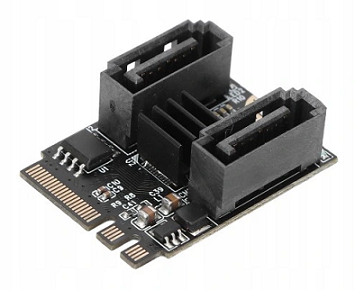
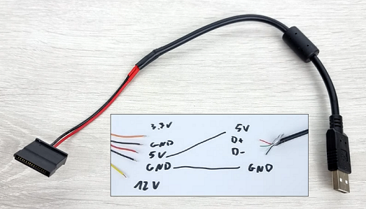
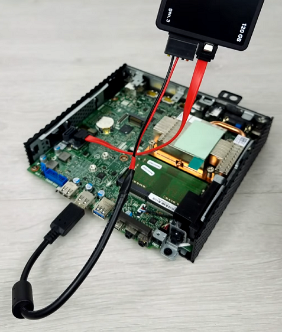

# srv01.maku.local

## Server Specifications for Hypervisor

Server: Dell Wyse 5070
* CPU: Intel® Celeron® J4105 @ 1.50 GHz
* RAM: 2 × 8 GB Samsung DDR4 2400 MHz SODIMM (CL17, PC4-2400T)
* Drive 1: ADATA Ultimate SU650 1 TB M.2 2280 SATA SSD
* Drive 2: ADATA Ultimate SU650 1 TB 2.5″ SATA III SSD

## ⚠️Adding a Second Drive for RAID1 on Dell Wyse 5070

This model is equipped with only a single M.2 SATA SSD slot, which makes setting up RAID1 impossible without minor hardware modifications.
To enable RAID1, an additional SATA drive can be added using the following approach:
1. Install an M.2 to SATA 3.0 adapter – the adapter can be placed in the slot originally intended for the WiFi/Bluetooth card.
2. Provide power for the additional drive – since thin clients like the Wyse 5070 typically lack extra power connectors, a custom power cable is required.
    * In this setup, a SATA power cable was soldered to a USB-A connector, effectively powering the SATA SSD directly from a USB port.
3. Reduce the drive’s physical size – it’s recommended to remove the SSD’s external casing to make it fit more easily inside the compact enclosure.

This modification allows the system to host two drives — one M.2 SATA and one standard SATA — which can then be configured as a RAID1 array for redundancy.





## Server Preparation

1. Create a **Bootable USB** drive (e.g. using `Rufus`) with the latest `Oracle Linux Boot ISO`, available at: https://yum.oracle.com/oracle-linux-isos.html  
    Then:
    * Place the file `ks.cfg` in the `/isolinux/` directory on the **Bootable USB** (make sure it uses Unix line endings).
    * Edit `/EFI/BOOT/grub.cfg` on the **Bootable USB** and add the parameter `inst.ks=hd:LABEL=<LABEL_NAME>:/isolinux/ks.cfg` to the boot command, as shown in the example below:

```bash
menuentry 'Install Oracle Linux 9.3.0' --class fedora --class gnu-linux --class gnu --class os {     
    linuxefi /images/pxeboot/vmlinuz inst.repo=hd:LABEL=OL-9-3-0-BA inst.ks=hd:LABEL=OL-9-3-0-BA:/isolinux/ks.cfg quiet
    initrdefi /images/pxeboot/initrd.img 
}
```

```diff
- Important: the LABEL value for inst.ks must match the LABEL value for inst.repo (e.g. LABEL=OL-9-3-0-BA == LABEL=OL-9-3-0-BA).
```

2. Boot from the USB drive and select Oracle Linux installation. During boot, press `e` to verify that the modified boot command in `/EFI/BOOT/grub.cfg` is correct. The installation process is **fully automated — do not interfere with it** (avoid using the mouse or keyboard).

3. After installation completes and the system restarts, **remove the Bootable USB drive**.

4. Enable **fail2ban**:
```bash
nano /etc/fail2ban/jail.local --->
    [sshd]
    enabled = true
    mode    = normal
    port    = ssh
    logpath = %(sshd_log)s
    backend = %(sshd_backend)s
```
```bash
systemctl restart fail2ban.service
```

5. Generate an **SSH key** as user `maku` (repeat for other users if needed):
```bash
ssh-keygen -t rsa -b 2048
```
* Upload `/home/maku/.ssh/id_rsa.pub` to the MikroTik device.
* Import the uploaded public key for the corresponding user in MikroTik.

6. Verify installation:
```bash
ksvalidator ./ks.cfg
ksvalidator /root/original-ks.cfg
cat /etc/crontab
cat /var/log/cron
grep cron-backup /var/log/messages
grep cron-update /var/log/messages
tail -f /var/log/messages
./post_base_tests.sh    # file from this repo
```

7. BIOS configuration:
```bash
sudo systemctl restart --firmware-setup
```
* In BIOS, enable the option to automatically power on the server after power loss (`Power On after AC Loss`).

8. Restore required files from backup (or fresh from repo) into the `/share` directory.  
Example structure:
```text
/share/
├── backups/
│   ├── backup_mikrotik_20250421.backup
│   ├── backup_mikrotik_20250505.backup
│   ├── backup_srv01_20250421.tar.xz
│   └── backup_srv01_20250505.tar.xz
├── docker-compose/
│   ├── adguard-home
│   ├── file-browser
│   ├── gitlab
│   ├── grafana
│   ├── home-assistant
│   ├── librespeed
│   ├── nginx
│   ├── passbolt
│   ├── pgadmin
│   ├── phpmyadmin
│   ├── portainer
│   ├── prometheus
│   ├── selenium
│   ├── semaphore
│   ├── template-compose.yml
│   ├── upsnap
│   ├── vault
│   ├── zabbix
│   └── zigbee2mqtt
└── manage.sh
```

9. Start containers using the `manage.sh` script.

10. Update DNS configuration:  
Edit `/etc/resolv.conf` and set the DNS address to `172.25.100.10` (AdGuard).

11. Once all containers are running, add the following line to `/etc/docker/daemon.json` (Prometheus):
```bash
"metrics-addr": "192.168.200.1:9323"
```
```bash
systemctl daemon-reload
systemctl restart docker
```

12. Disable the CUPS printing service:
```bash
systemctl disable cups.service
systemctl stop cups.service
```

## Replacing a Failed Disk (RAID 1)

1. Check raid health:
```bash
cat /proc/mdstat
sudo mdadm --detail /dev/md0
```
2. Mark the failed disk and remove it from the array:
```bash
sudo mdadm --manage /dev/md0 --fail /dev/sdb1
sudo mdadm --manage /dev/md0 --remove /dev/sdb1
```
3. Physically replace the failed drive with the new disk.
4. Partition the new disk:
Ensure the new disk matches the partition layout of the working one. You can clone the partition table from the healthy disk:
```bash
sudo sfdisk -d /dev/sda | sudo sfdisk /dev/sdb
```  
* Verify partitions with `lsblk` or `fdisk -l` before proceeding.  
5. Add the new disk to the RAID array:
```bash
sudo mdadm --manage /dev/md0 --add /dev/sdb1
```
6. Monitor the rebuild process:
```bash
watch cat /proc/mdstat
```  
* You can also use `cat /proc/mdstat` periodically or `sudo mdadm --detail /dev/md0` to track rebuild progress.

## Expanding a Logical Volume (by +10G)

### 1️⃣ Extend the Physical Partition
1. Check current partitions:
```bash
lsblk
sudo fdisk -l
```
2. Use `fdisk` to extend the partition:
```bash
sudo fdisk /dev/sda
```
* Delete the old partition (`d`) — keep the same start sector
* Create a new partition (`n`) with the same start sector and size `+10G`
* Write changes (`w`)

### 📝 Note on **RAID1**  
* If the partition is part of a RAID1 array, extend the RAID array with `mdadm`:
```bash
sudo mdadm --grow /dev/md0 --size=max
```
* Then proceed with LVM PV resize and logical volume expansion.

### 2️⃣ Update LVM Physical Volume  
If the partition belongs to a Volume Group (VG):
```bash
sudo pvresize /dev/sda1
```

### 3️⃣ Extend the Logical Volume  
Assuming you want to extend `/dev/vg0/lv_home` by 10 GB:
```bash
sudo lvextend -L +10G /dev/vg0/lv_home
```

### 4️⃣ Resize the Filesystem
* ext4:
```bash
sudo resize2fs /dev/vg0/lv_home
```
* XFS (mounted):
```bash
sudo xfs_growfs /mount/point
```

### 5️⃣ Verify
```bash
df -h
lsblk
sudo lvdisplay
```

## Backup

The server performs automated backups on a bi-weekly basis using a cron job. The configuration for user `maku` is created during automatic system installation.

1. The cron job runs every `Monday at 01:00`.
2. The command checks whether the week number is even (`% 2 == 0`) — backups are performed every other week.
3. The `manage.sh` script executes the following steps:
* Stops all running containers.
* Creates backups of all MikroTik configurations and docker-compose related files.
* Restarts all containers after the backup is complete.
4. All backups are stored in the `/share/backups/` directory.

---

🔒 Sensitive data such as keys, IP addresses, and other private values have been intentionally replaced with the placeholder string `<HIDDEN_DATA>`.
