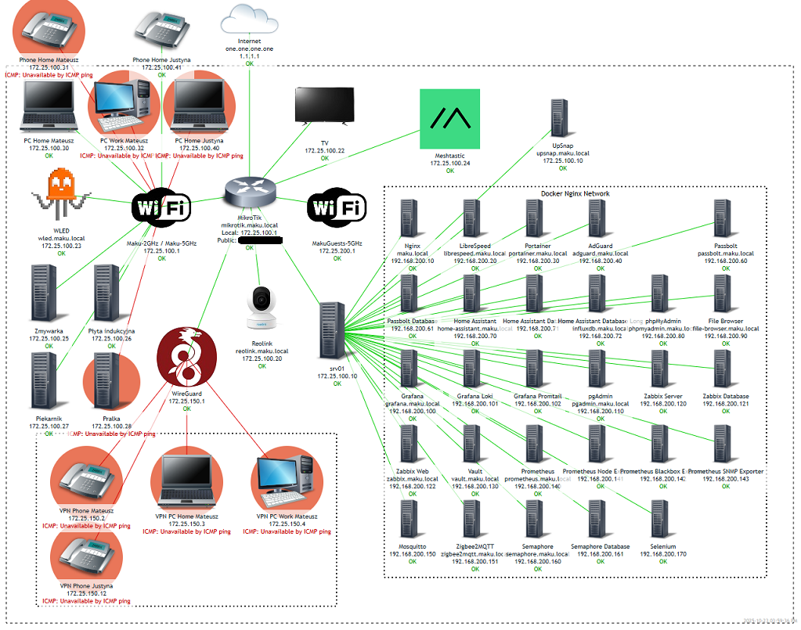
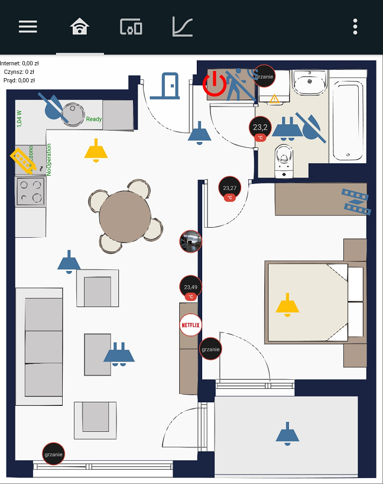

# My personal Smart HomeLab – a self-hosted setup for everyday use.

> [!CAUTION]
> in the future, migrating from docker-compose to Kubernetes with Helm.

### 📁 Repository structure

- [**MikroTik_hAP_ax2/**](./MikroTik_hAP_ax2) – configuration and setup files for the home router (MikroTik hAP ax²).  
- [**Dell_Wyse_5070/**](./Dell_Wyse_5070) – configuration and system setup for the mini home server (Dell Wyse 5070).  
- [**docker-compose/**](./docker-compose) – individual Docker Compose stacks for each service, including configuration and supporting files.

Each component forms part of the home infrastructure – from networking and hardware setup to containerized services.

